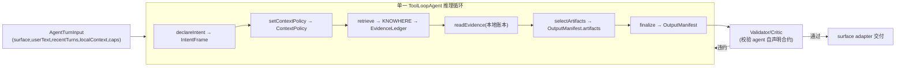

# Knowhere Agent Harness 重构方案

## 0. 目标与不变量

- KNOWHERE-MAIN **不改动**。它已是纯 evidence provider(`POST /v1/retrieval/query` 永远 agentic、`answer_text` 恒空,返回 `evidence_text` / `results` / `referenced_chunks` / `decision_trace` / `stop_reason`)。所有理解、判断、选图、回答归外围 agent。
- 一套核心、两个 surface:`notebook_chat` 与 `typing_compose`(及 `typing_quick_ask`)。
- 架构哲学(2A):**单推理循环 deep agent**。harness 提供工作记忆 + 工具 + 合约校验,不写业务 if 分支。
- 代码共享(1C):新建顶层规范源目录,脚本同步进两个仓库,后续可平滑升级为 npm 包。

## 1. 共享与分发(1C)

- 新建规范源:`/Users/wuchengke/Desktop/knowhere/knowhere-agent-harness/`(纯 TS,仅依赖 `ai`、`zod`,与两边版本兼容)。
- 同步脚本:`scripts/sync-harness.sh`(copy 到目标 + 写 `HARNESS_REV` 哈希),两仓库各放一份反向校验脚本;CI/dev 比对哈希检测漂移。
  - notebook 落点:`src/agent-harness/`
  - typing 落点:`sidecar/knowhere-agent/src/harness/`
- 两边运行时都能消费:Next.js(Node)与 Bun `--compile` 都可 bundle 纯 TS。

## 2. 核心抽象(surface 无关)

工作记忆全部由 agent 经工具读写,代码只做状态管理与守护:

- `IntentFrame`: task、dependsOnPreviousTurn、retrievalNeeded、targetModalities、constraints{desiredCount,maxCount,language,outputStyle,citationRequired}、groundingPolicy。"要2张图" = agent 推理出的 `constraints.desiredCount=2`,非正则。
- `ContextPolicy`: carryHistory("none" | "referential_only" | "full_recent" | "repair_previous")、reason、activePriorTurnIds。解决"第二个无关问题返回第一轮答案"——由 agent 判断,不靠代码塞历史。
- `RetrievalPlan`: 可日志化步骤(retrieve / read_more / select_artifacts / compose)。
- `EvidenceLedger`: 跨多次 retrieve 累积的 chunks / assets / decisionTrace / stopReason / failureReason。KNOWHERE 给的是候选,不等于最终输出。
- `OutputManifest`: text、citations[]、artifacts[{type,ref,display,reason}]、unresolved[]。**最终回答不再是裸 markdown 字符串**。

## 3. 工具集(agent 唯一的行动方式)

- `declareIntent(IntentFrame)`:必须最先调用(harness 门控,合约级而非话题级)。
- `setContextPolicy(ContextPolicy)`:agent 决定是否/如何带历史。
- `retrieve({query,modalities,topK,signalPaths,filterMode,threshold})`:封装 KNOWHERE,query 由 agent 拟定(替代 notebook `searchSources`、typing `planQueries+retrieveKnowledge`),结果进 EvidenceLedger。
- `readEvidence({ref,offset,limit})`:读账本里某 chunk 更多内容(本地,等价 notebook `readRetrievedChunk`,无需再打 KNOWHERE)。
- `selectArtifacts({refs[],reason})`:agent 显式声明展示哪些资产 → 这才是"只发2张图"的来源。
- `finalize({text,citations,artifacts,unresolved})`:产出 OutputManifest,结束循环。

门控只在**合约层**:`declareIntent` 必须在前;`retrieve` 仅在意图声明后可用;若 `groundingPolicy=must_use_sources`,无证据时禁止 `finalize`。不再硬编码"前两步必须搜索"。

## 4. 合约校验器(守护而非业务硬编码)

`finalize` 后对照 agent **自己声明的 IntentFrame** 校验:
- artifacts 数量满足 agent 声明的 desiredCount/maxCount。
- `groundingPolicy=must_use_sources` → 必须有 citations/evidence。
- `carryHistory=none` → 输出不得引用上一轮主题(软校验)。
- KNOWHERE `stop_reason=no_documents_selected`/空 → 禁止编造。
- `surface=typing_compose` → 文本必须是纯插入文本(无 markdown/meta)。

违约 → 回灌结构化反馈让 agent 修订一次;再不行 → 优雅返回"证据不足/需澄清"。

## 5. Surface 适配器

- Notebook(`notebook_chat`):thread 历史 → recentTurns;retrieval 绑 workspace namespace + excludedSourceIds;OutputManifest → assistant message{content,citations,artifacts};**前端只渲染 `message.artifacts`**,不再遍历全部 image citation。
  - 改造点:[src/domains/chat/index.ts](knowhere-notebook/src/domains/chat/index.ts)(`answerQuestionWithRetrieval` 改为调用 harness)、[src/domains/chat/prompt.ts](knowhere-notebook/src/domains/chat/prompt.ts)(prompt/agent 逻辑迁入 harness,删除 legacy `generateContextualRetrievalQuery`/`generateGroundedAnswer`)、[src/domains/chat/retrieval.ts](knowhere-notebook/src/domains/chat/retrieval.ts)(query 规范化迁入 retrieve 工具)、[src/domains/chat/service.ts](knowhere-notebook/src/domains/chat/service.ts)、[src/integrations/knowhere.ts](knowhere-notebook/src/integrations/knowhere.ts)(暴露 RetrievalCapability)、[src/components/chat-message-list.tsx](knowhere-notebook/src/components/chat-message-list.tsx)(按 artifacts 渲染)。
  - 数据模型:`chat_messages` 增 `artifacts` jsonb + `metadata` jsonb(存 intent/plan/trace 供调试),见 schema。
- Typing(`typing_compose`):focusedSnapshot → localContext + userText;outputCapabilities={text,inlineInsertion};OutputManifest.text → 纯插入文本;保留 stdio NDJSON,并补发此前未实现的 `meta` 事件。
  - 改造点:[sidecar/knowhere-agent/src/compose.ts](knowhere-typing/sidecar/knowhere-agent/src/compose.ts)(改为 harness 驱动,extractIntent/planQueries/setMode 收敛为 harness 工具)、[sidecar/knowhere-agent/src/retrieval.ts](knowhere-typing/sidecar/knowhere-agent/src/retrieval.ts)、[sidecar/knowhere-agent/src/protocol.ts](knowhere-typing/sidecar/knowhere-agent/src/protocol.ts)、[sidecar/knowhere-agent/src/tools.ts](knowhere-typing/sidecar/knowhere-agent/src/tools.ts);`validateComposeProtocol` 升级为 harness 的 typing 校验 profile。
- 模型注入:notebook 传 AI Gateway 模型(`CHAT_MODEL`),typing 传 OpenAI-compatible 模型;harness 自身 model-agnostic。

## 6. 解决你提的三个具体问题(均由 agent 推理 + 合约保证)

- 无关多轮污染 → `ContextPolicy` 由 agent 判定 `carryHistory=none`,并记录 reason 供调试。
- 只发指定数量图 → agent `declareIntent.desiredCount` + `selectArtifacts`,UI 仅渲染 manifest;校验器兜底数量一致。
- 输出不智能 → 显式 intent/plan/evidence/critic 闭环 + 可观测 trace,落到 message.metadata,出问题可还原 agent 当时搜了什么、选了什么。
- 附带小卫生项:同步 notebook `package-lock.json` 残留 `@ontos-ai/knowhere-sdk ^0.4.0` 与 pnpm-lock 的 0.6.0。

## 7. 回归评测集(harness regression)

unrelated follow-up / correction turn / image-count intent / text+image mixed / NOT_FOUND 不编造 / typing continue 必检索 / generic rewrite 不检索。作为 harness 单测与两 surface 集成测试。

## 8. 阶段划分

- Phase 1:建规范源目录 + 同步脚本 + 核心类型与工具 + 校验器 + 单测/评测集骨架。
- Phase 2:notebook 适配器接入,artifacts 持久化 + 前端 manifest 渲染,/api/chat 响应向后兼容。
- Phase 3:typing compose 迁入同一 harness,补 `meta` 事件,校验 profile 化。
- Phase 4:跑回归评测,清理 legacy 代码与 lockfile。